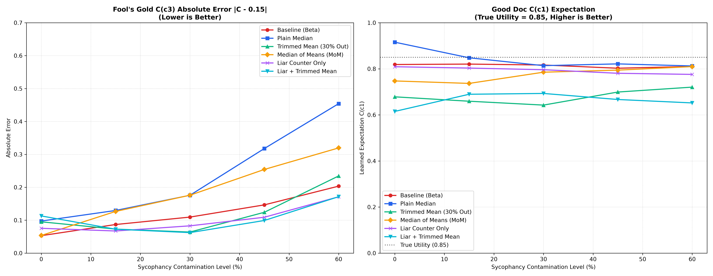
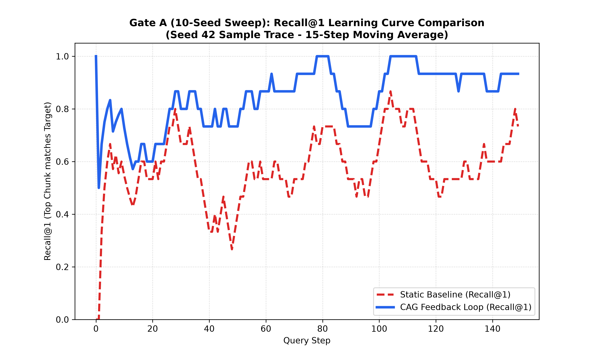
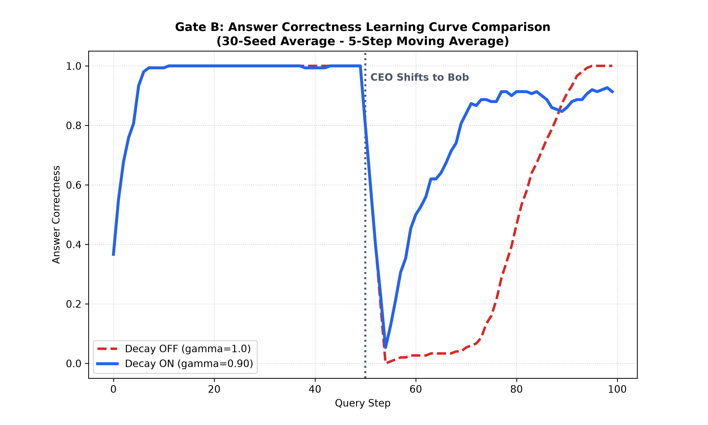
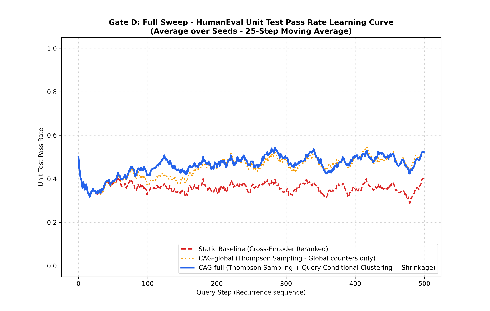
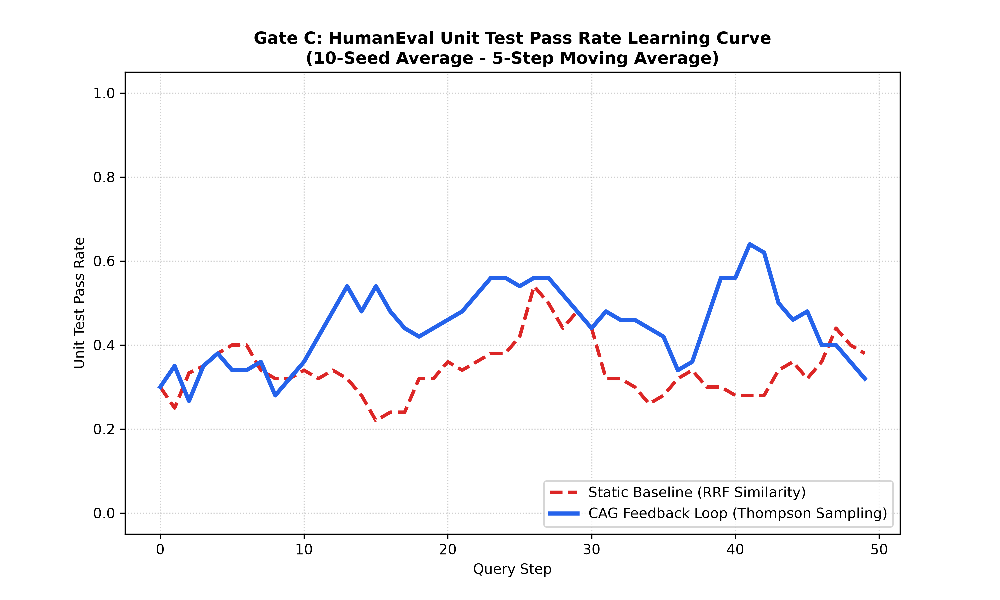

# RRL — A Retrieval Reputation Layer

> **RRL** = **R**etrieval **R**eputation **L**ayer. *Not* to be confused with Cache-Augmented
> Generation ("CAG"); RRL is a ranking-time reputation layer, not a retrieval-free method.

RRL is **not a retriever.** It is a lightweight **reputation layer that sits on top of any
retriever and converts verified downstream outcomes into a ranking signal** — boosting
documents that have *actually produced good results* and decaying ones that go stale. It is
built around per-document Beta counters updated from feedback (verifier, user behavior, LLM
judge, thumbs), with explicit safeguards against noisy and sycophantic feedback.

The novelty is **not** finding relevant documents (rerankers already do that well). It is
folding **verified historical usefulness** into ranking, while handling staleness and noisy
feedback.

> **What it is:** a reputation / usefulness-and-freshness layer for closed-loop retrieval.
> **What it is not:** a better retriever, or a truth detector. It adds no value where queries
> don't recur or where there's no trustworthy feedback to learn from.

### When it helps — and when it doesn't (the boundary condition)

The central, evidence-backed claim is deliberately **conditional**:

> **Recurrence + a trustworthy verifier →** RRL accumulates outcome signal and helps.
> **No recurrence →** RRL cannot accumulate signal and *slightly underperforms* a strong
> baseline (a small exploration tax).

Both halves are demonstrated. We show a strong cross-encoder reranker **beating** RRL in a
one-shot, non-recurring setting (Gate C) — that boundary is stated up front, not hidden. The
*same* mechanism explains both the wins and the loss, which is the point: this is outcome-aware
retrieval *under specific conditions*, not a universally superior retriever.

This is a **research/experimental** project built around honest evaluation. See
[Validation Status](#validation-status) for exactly what is and isn't established.

---

## Where it fits

Two properties decide whether RRL helps: **trustworthy feedback** (a verifier, or a
controlled/trusted source) and **repetition** (similar queries recur enough for counters to
converge).

| Use case | Fit | Why |
|---|---|---|
| **Coding agents with *recurring* tasks** (reused fix patterns / snippets) | **Strongest** | Hard verifier (tests) **+ recurring problem families** → reputation converges |
| **Enterprise RAG over trusted docs** | Strong | Recurring question types + controlled source; decay handles *staleness* |
| **Internal tools / agents over controlled data** | Strong | Same logic as above |
| **One-shot / non-recurring retrieval** | **No value** | Nothing to accumulate — a strong reranker wins (Gate C boundary) |
| **Open web / public user-generated content** | **Avoid** | Adversarial + unverifiable feedback → the >50% identifiability wall (see Limitations) |

---

## Architecture

```
              ┌──────────────┐   text query    ┌──────────────────────────┐
  documents → │  ingest.py   │ ───────────────► │       retriever.py       │
              │ chunk+embed  │                  │  hybrid RRF (vec + BM25) │
              └──────────────┘                  │  + Beta exploration      │
                                                │  + C_robust exploitation │
                                                └────────────┬─────────────┘
                                                             │ top-k + credit shares r(i)
                          feedback (y)                       ▼
   ┌──────────────┐   ┌──────────────────┐        ┌────────────────────────┐
   │   judge.py   │──►│   feedback.py    │ ─────►  │  store.py / store_     │
   │ (faithfulness│   │ outcome y, κ     │ counters│  sqlite.py (persistent,│
   │  + fallback) │   │ liar counter,    │ update  │  atomic, lazy decay,   │
   └──────────────┘   │ robust estimators│        │  pending bridge)       │
                      └──────────────────┘        └────────────────────────┘
```

| Module | Responsibility |
|---|---|
| `rrl/store.py` | `Candidate` dataclass (α/β, A/B, `fooled`/`verified`, `recent_outcomes`) + in-memory `CandidateStore` |
| `rrl/store_sqlite.py` | Persistent store: durable, **lazy decay**, **atomic increments**, `pending` (retrieve↔feedback bridge), schema migration |
| `rrl/retriever.py` | Hybrid retrieval (SentenceTransformer + custom BM25, RRF-fused), Thompson-sampling exploration, rarity bonus, ε-greedy, robust exploitation estimate |
| `rrl/feedback.py` | Outcome aggregation `y`, soft κ-weighted update, liar counter, robust estimators, optional ADT denoising |
| `rrl/judge.py` | LLM faithfulness judge (Gemini) with a token-overlap fallback when offline |
| `rrl/ingest.py` | Document chunking + embedding into candidates |
| `rrl/api.py` | FastAPI service: `POST /retrieve`, `POST /feedback`, `GET /health` |

---

## Install

Requires Python 3.10+. Install the package with the extras you need:

```bash
pip install -e .                 # core retrieval (sentence-transformers, numpy, scipy, scikit-learn)
pip install -e ".[api]"          # + FastAPI service
pip install -e ".[llm]"          # + live LLM judge (else heuristic fallback)
pip install -e ".[dev]"          # + simulations/plots and the test suite
pip install -e ".[api,llm,dev]"  # everything
```

To reproduce the benchmark gates against the exact validated dependency versions, use the
pinned set instead: `pip install -r requirements.txt`.

> The first retrieval downloads the `all-MiniLM-L6-v2` model (~80 MB). The LLM judge needs
> `GEMINI_API_KEY` or Vertex AI credentials; without them it falls back to a local heuristic.

---

## Quickstart (library)

```python
from rrl.store import CandidateStore
from rrl.ingest import Ingester
from rrl.retriever import Retriever
from rrl.feedback import OutcomeSignals, update_counters

store = CandidateStore()
ingester = Ingester()
ingester.ingest_document(store, "doc1", "Long document text ...")

# weights = (w_sim, w_c, w_p, w_explore)
retriever = Retriever(store, weights=(0.20, 0.40, 0.10, 0.30))

results = retriever.retrieve("my question", top_k=3, explore=True)
retrieved_sims = {cand.id: sim for cand, score, sim in results}

# After observing how the answer landed, feed an outcome back:
signals = OutcomeSignals(s_behave=0.9, s_gt=1.0, s_judge=0.8, s_expl=1.0)
from rrl.feedback import calculate_outcome
y = calculate_outcome(signals)                 # y in [0,1]
update_counters(store, retrieved_sims, y, signals=signals)
```

## Quickstart (API)

```bash
uvicorn rrl.api:app --reload     # uses SqliteCandidateStore at $RRL_DB_PATH (default rrl.db)
```

```bash
# 1) retrieve — returns a response_id and freezes credit shares server-side
curl -X POST localhost:8000/retrieve -H 'content-type: application/json' \
  -d '{"query":"how do I avoid db anomalies?","top_k":3}'

# 2) feedback — references that response_id; updates counters atomically
curl -X POST localhost:8000/feedback -H 'content-type: application/json' \
  -d '{"response_id":"<id-from-step-1>","s_behave":0.9,"s_gt":1.0}'
```

`/retrieve` persists the frozen credit shares to the `pending` table; `/feedback` pops them
and applies the update through the store's **atomic** `increment()` — safe under concurrent
requests.

---

## How it works

**Ranking.** Each candidate is scored:
```
score(i) = w_sim·sim(i) + w_c·C_robust(i) + w_p·P(i)         # exploitation
         + w_explore·sim(i)·(ThompsonSample(α,β) + rarity)   # exploration (when explore=True)
```
- `sim(i)` — hybrid vector+BM25 relevance, RRF-fused and normalized.
- `C_robust(i)` — recent usefulness (Beta mean by default; see robust estimators).
- `P(i) = A/(A+B)` — long-term usefulness.
- Exploration is **scaled by `sim`** so it never surfaces wholly irrelevant docs.

**Outcome.** Feedback signals are aggregated into `y ∈ [0,1]`. If a verifier `s_gt` is present
it overrides (it's the one signal that can't be faked); otherwise a weighted mean of
`s_behave (0.45)`, `s_gt (0.30)`, `s_judge (0.15)`, `s_expl (0.10)`, renormalized over present signals.

**Update.** Decisiveness `κ = 2·|y−0.5|`; credit share `r(i)` from similarity (smoothed);
`α += κ·r·y`, `β += κ·r·(1−y)` (permanent A/B at a 0.25 rate). An ambiguous outcome (`y≈0.5`)
barely moves the counters; a decisive one moves them fully.

**Decay.** `x ← 1 + (x−1)·γ^Δt` pulls stale counters back toward the prior, computed lazily
from `last_updated` (no cron sweep).

---

## Robustness & denoising

Naive learning from implicit feedback can degrade — a known result in the literature. RRL
includes safeguards, evaluated in a 20-seed ablation (`sim/verify_robustness.py`):

| Mechanism | Status | Notes |
|---|---|---|
| **Behavioral cap** (positive `s_behave` ≤ 0.75) | **Adopted** | Asymmetric: trusts rejections fully, caps sycophantic "accepts" |
| **Verifier anchor** (`gt_override`) | **Adopted** | The one sycophancy-proof signal dominates when present |
| **Liar counter** (`fooled`/`verified` → per-doc `trust_score`) | **Adopted (default)** | Detects "accepted-but-verifier-failed"; lowest collateral damage to good docs |
| Trimmed mean (drop top 30%) | **Rejected** | Strong on contaminated data but biased *down* on clean data — craters good docs |
| Median-of-Means | **Rejected** | Block-averaging pre-mixes uniform contamination → ≈ the plain mean |
| ADT loss-downweighting | Optional, off by default | Helps *random* noise; does **not** help sycophancy (the lie is low-loss) |

**Honest bound:** these *mitigate* sycophancy, they do not *solve* it. Effectiveness is capped
by verifier coverage, and above ~50% contamination no estimator on the feedback values alone
can recover truth (information-theoretic). Robust estimator modes are selectable via
`robust_estimator_mode` (`"beta"` default, `"median"`, `"trimmed"`, `"mom"`).



---

## Validation Status

Reported honestly — what the tests/sims actually establish, and what they don't.

### Validated ✅ — under recurrence + a verifier
- **Persistence layer** (`tests/test_store_sqlite.py`): durability across reconnect, lazy
  decay math, **atomic concurrent increments** (8 threads × 200, zero lost updates), and the
  pending retrieve↔feedback bridge. (35 tests pass, no resource leaks.)
- **API atomic path**: `/feedback` routes through `store.increment()`, not a Python
  read-modify-write — verified in the code path.
- **Robustness ablation** (20-seed): supports adopting the liar counter and rejecting
  trimmed-mean / MoM (below).
- **Gate A — outcome-aware ranking helps under recurrence** (`sim/run_gate_a.py`): 10-seed,
  top_k=1, with an **independent answer-verifier** that inspects only the generated answer
  (never the retrieved doc IDs), so the training signal can't leak the eval label. Under
  recurrence, RRL's answer correctness separates from a static baseline with **non-overlapping
  95% CIs**. *Scope:* controlled corpus, synthetic keyword-verifier — a proof of mechanism, not
  a production number.
  
  
- **Gate B — decay helps adaptation** (`sim/run_gate_b.py`, **30-seed**): ground truth flips at
  step 50. Post-shift correctness: decay-OFF **0.417 [0.364, 0.469]** vs decay-ON
  **0.730 [0.673, 0.787]** — **non-overlapping CIs** (at n=10 they overlapped; 30 seeds settle
  it). Decay is what lets stale reputation fade.
  
  
- **Gate D — recurrence beats a strong reranker** (`sim/run_gate_d.py`): recurring-query
  benchmark (epochs over a fixed problem set) against a **cross-encoder** reranker. With
  recurrence, RRL (**global counters**) overtakes the reranker — the same reranker that *wins*
  without recurrence (Gate C). *Scope:* controlled synthetic hint corpus; see the realistic
  benchmark below.
  
  

### Boundary condition ⛔ — stated, not hidden
- **Gate C — no recurrence → a strong reranker wins** (`sim/run_gate_c.py`): one-shot HumanEval
  (50 distinct problems, ~1 visit each), **real Gemini generation**, **real unit-test verifier**.
  A production-grade cross-encoder reranker **beats RRL** — overall **65.2% [60.6, 69.8]** vs
  RRL **59.4% [54.4, 64.4]**. With no repeated traffic, the reputation loop has nothing to
  accumulate, so RRL only pays a small exploration tax. *This negative result is central* — it
  constrains the claim to the recurrence regime instead of pretending RRL is universally better.
  
  

### NOT yet validated ⚠️ (the important part)
- **Realistic recurring-query benchmark — IN PROGRESS.** The recurrence win (Gate D) is on a
  *synthetic* hint corpus. The honest next step is the same result on a **real** corpus with
  naturally recurring problem families (`sim/run_gate_recurring.py`, MBPP).
- **No-verifier case — UNPROVEN.** Every gate above uses a hard verifier. Behavior on purely
  behavioral/judge feedback (no `s_gt`) is bounded by the robustness limits below.
- **Query-conditional clustering — EXPERIMENTAL.** The "reputation per query-kind" variant
  exists in code but adds only ~1 pt over global counters and is **not validated** (cluster
  stability / fragmentation / sparse-shrinkage). Treated as **future work**; every validated
  result above uses global counters.
- **Real-traffic degeneracy** (popularity-bias amplification): the exploration defense is
  implemented but **not yet monitored**.

---

## Limitations & scope

- **Not a truth detector.** It tracks usefulness and freshness, not correctness.
- **Verifier-bounded.** Robustness against bad feedback rises and falls with how often a
  verifier (`s_gt`) is available.
- **The >50% wall.** If a majority of feedback for an item is dishonest, no statistic on the
  feedback alone recovers truth — by information theory. Scope RRL to controlled/verifiable
  settings.
- **Exploration cost.** Exploration improves discovery but can evict correct results from a
  small top-k; tune `epsilon`/`explore` to your top-k.
- **Not novel research.** This is a clean implementation of established ideas (online
  learning-to-rank with bandit feedback, Beta-Bernoulli reliability, recsys denoising). The
  intended value is a tidy, honestly-evaluated, drop-in layer — not a new algorithm.

---

## Repository layout

```
rrl/                  core library (store, retriever, feedback, judge, ingest, api, store_sqlite)
sim/                  gates: verify_robustness.py, run_gate_a.py (value), run_gate_b.py (decay),
                      run_gate_c.py (no-recurrence boundary), run_gate_d.py (synthetic recurrence),
                      run_gate_recurring.py (realistic recurrence, MBPP), gate_c_verifier.py
data/                 HumanEval.jsonl (164 problems, OpenAI · MIT) and mbpp.jsonl (974 problems,
                      Google MBPP · CC-BY-4.0) — real unit-test verifier substrates
tests/                test_feedback.py, test_store_sqlite.py, test_robustness.py, test_api.py
ROADMAP.md            phased build plan
```

## Running tests & simulations

```bash
python3 -m unittest discover -s tests -p "test_*.py"     # unit tests (35, no resource leaks)
python3 sim/verify_robustness.py                         # robustness ablation (20-seed)
python3 sim/run_gate_a.py                                # Gate A: value under recurrence (10-seed)
python3 sim/run_gate_b.py                                # Gate B: decay / freshness (30-seed)
python3 sim/run_gate_c.py                                # Gate C: no-recurrence boundary (needs Gemini)
python3 sim/run_gate_recurring.py --selftest            # realistic benchmark: offline plumbing check
USE_REAL_GEMINI=true python3 sim/run_gate_recurring.py   # realistic recurring benchmark (MBPP, real LLM)
```

## Related work

RRL sits between two active areas, and is deliberately a *smaller* mechanism than either.
Full positioning + citations in [RELATED_WORK.md](RELATED_WORK.md).

- **Agent memory / experience reuse** — Evo-Memory + ReMem ([arXiv:2511.20857](https://arxiv.org/abs/2511.20857)),
  ExpeL, Agent Workflow Memory, Dynamic Cheatsheet, Agentic Context Engineering. These
  *extract and inject* workflows/insights at the prompt level. **RRL works one level lower** —
  per-document Beta reputation at the *ranking* level, writing no new memory artifacts and
  putting no LLM in the memory loop.
- **Online / feedback RAG reranking & LTR** — DynamicRAG, AutoRAG-HP, LTRR, Online-Optimized
  RAG, REARANK. These *train/prompt a reranker* from feedback. **RRL keeps the reranker fixed**
  and adds a non-parametric reputation prior with staleness decay, noise/sycophancy safeguards,
  and a stated boundary condition.
- **Statistical lineage (not novel, by design)** — Beta Reputation System (Jøsang & Ismail
  2002), Beta-Bernoulli click models, bandit learning-to-rank. The contribution is the clean,
  safeguarded, honestly-evaluated *integration*, not the estimator.
- **Evaluation honesty** — aligns with ["Benchmarking is Broken"](https://arxiv.org/html/2510.07575v2);
  RRL independently caught and fixed an LLM-judge circularity (see Gate A history).

**Not yet compared on** the standard streaming benchmark (Evo-Memory) or a strong full stack —
see [RELATED_WORK.md](RELATED_WORK.md) for the honest gap list.

## Future work

1. **Realistic recurring-query benchmark** — reproduce the Gate D recurrence win on a *real*
   corpus with naturally recurring problem families (MBPP), not the synthetic hint corpus.
   (`sim/run_gate_recurring.py`.)
2. **Query-conditional reputation (clustering).** Learn "what worked *for this kind of query*"
   rather than globally. Implemented but **not validated** — needs evidence on cluster
   stability, fragmentation, sparse-cluster shrinkage, and clustered-vs-global lift before it
   is a claim rather than a proposal.
3. **Strong-stack comparison.** *Strong Stack* vs *Strong Stack + RRL* (hybrid retrieval +
   query rewriting + multi-query + agent memory), not just retriever-level. The eventual
   deployment-relevant test.
4. **No-verifier validation** — behavior under purely behavioral/judge feedback (e.g.
   cross-model agreement as a pseudo-verifier).
5. **Degeneracy monitoring** (retrieval concentration / coverage) before any real deployment.
6. **Package** as a pip-installable layer over LangChain / LlamaIndex retriever interfaces.

See `ROADMAP.md` for the full plan.

---

## License

This project is licensed under the MIT License - see the [LICENSE](LICENSE) file for details.

